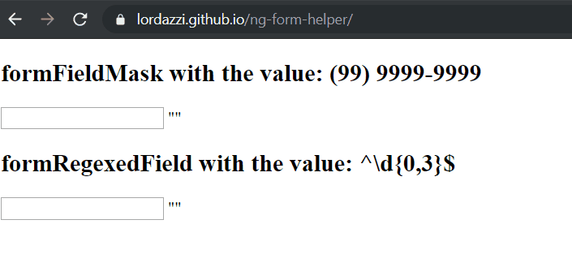

# Form Helper, for Angular application (for version 7 or over)

This is a simple mask lib with two single directives: a directive to allow field data entry from being just characters mapped by a regular expression and a directive to mask values, it works exclusively for numeric values.

## Overview

https://lordazzi.github.io/ng-form-helper/

## Installation

First execute the following command in the root folder of your angular application:

```npm install ng-form-helper@latest --save```

Then, you must import the library main module in your app.module, like this:

```typescript
import { NgModule } from '@angular/core';
import { FormsModule } from '@angular/forms';
import { BrowserModule } from '@angular/platform-browser';
import { FormHelperModule } from 'projects/ng-form-helper/src/public-api';
import { AppComponent } from './app.component';


@NgModule({
  declarations: [
    AppComponent
  ],
  imports: [
    BrowserModule,
    FormsModule,
    FormHelperModule
  ],
  bootstrap: [
    AppComponent
  ]
})
export class AppModule { }

```

## Usage

**The masked field:**
```html
  <input
    type="text"
    formFieldMask="(99) 9999-9999"
    [(ngModel)]="masked"
  />
```

1. Each 9 represents a number.
2. The mask must finish with a nine.
3. You should not put any number in the mask but nine, all other charactere are allowed.
4. The library have not a mask for date but you can create your own using the mask 99/99/9999 and using angular validators to valid the given date.

**The regexed field:**
```html
<input
  type="number"
  formRegexedField="^\d{0,5}$"
  [(ngModel)]="regexed"
/>
```

1. It is very cool to block data entry with a regular expression, but it could be not nice for UX: the user could not see that the field just ignore his given value.
2. Data entry blocked by a RegExp is nice for too large and unmasked number fields, like IMEI, ICCID or other large code.
3. You should remember that the regular expression will block the field to containing a value that it disagrees with, so do not create a regular expression that represents, for example, a valid email, but write a regular expression that allows input of data of any character allowed in an email.

## Customizing a field
In addition to the masks contained in this library, it also contains a class to make it easy to create custom fields in the angular.
The abstract directive ```FormFieldDirective``` contain the logic to write data in ReactiveFormsModule, FormsModule and NgModel, you can extends it as the example below (the example is the code of formRegexedField):

```typescript
import { Directive, ElementRef, forwardRef, HostListener, Input, Renderer2 } from '@angular/core';
import { NG_VALUE_ACCESSOR } from '@angular/forms';
import { FormFieldDirective } from './form-field.directive';

@Directive({
  selector: '[formRegexedField]',

  //  you wil provide only form this field an override
  //  for angular value acessor, as you can see below
  providers: [
    {
      provide: NG_VALUE_ACCESSOR,
      useExisting: forwardRef(() => InputRegexDirective),
      multi: true
    }
  ]
})
export class InputRegexDirective extends FormFieldDirective {

  @Input('formRegexedField')
  set setRegex(regex: string) {
    this.regexRule = new RegExp(regex);
  }

  private regexRule = /(?:)/;

  constructor(
    //  you must inject this guys as protected
    protected element: ElementRef,
    protected renderer: Renderer2
  ) {
    super();
  }

  //  the "input" event is the more appropriate to intercept data entry
  @HostListener('input', ['$event'])
  onInput(event: KeyboardEvent): void {
    //  ```getValueFromKeyboardEvent``` is a method from the parent class
    const value = this.getValueFromKeyboardEvent(event);

    if (this.regexRule.test(value)) {
      const cursorInitialPosition = this.element.nativeElement.selectionStart;

      //  this set the value in ngModel and in the field.
      this.updateFieldValue(value);
      this.setCursorPosition(cursorInitialPosition);
      return;
    }

    //  This method will reset either the field value and the cursor position.
    //  How it works:
    //  1. The user press the keyboard key
    //  2. The directive save the state
    //  3. The key value is delivered to the field
    //  4. This method will run and, and you choose if you override de value or disagree with it
    this.resetField();
  }
}
```